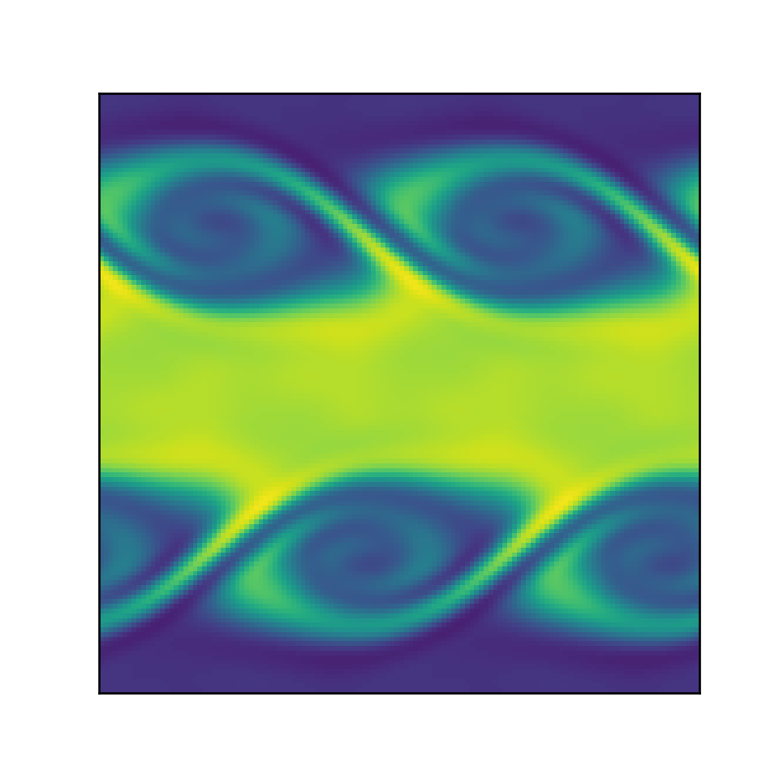

# DD2356 - Kevin Helmholtz
This repo contains the results of a C port from pre-existing Python code (Source: https://github.com/pmocz/finitevolume-python) simulating the Kevin-Helmholtz phenomena. 
This port was done as part of a final project in the course DD2356 - Methods in High Performance Computing at KTH.

## How to run
To compile each of the three versions to run on dardel, use the commands:

    cc ser.c -openmp -lm -O3 -o ser.o
    c omp.c -openmp -lm -O3 -o omp.o
    cc mpi.c -openmp -lm -O3 -o mpi.o

The serial version takes one paramater as an input, this paramater is used
to determine the resolution of the simulation to run. If you execute it with:

    srun -n 1 ./ser.o 128 
you will perform a simulation using a 128 x 128 matrix

The omp version takes two paramaters as input. The first parameter is the
resolution of the simulation to run, the second is the number of omp threads to use. So if you execute it with

    srun -n 1 ./omp 128 16
You will perform a simulation using a 128 x 128 matrix using 16 threads

The mpi version takes two parameters as input. The first parameter is the resolution used in the simulation to run. The second parameter is how many omp threads each mpi process will use. So if you run it with:

    srun -n 2 ./mpi 128 32
You will run a simulation for a 128 x 128 matrix across two nodes, each using 32 threads for a total of 64 threads.

A limitation of the mpi implementation is that the number of nodes you run on needs to be divisible by the resolution of the matrix. In order to correctly divide the work between nodes, the number of nodes divided by the matrix resolution also needs to be greater than 3.

### How to verify results
To validate the results of your calculation against the python implementation(only possible for smaller calculations), first run your calculation in one of the methods above. This will generate an outputfile named serialoutput.bin, ompoutput.bin or mpioutput.bin. 

Run the python file verify.py and input the name of the outputted file that you wish to verify. This will run the same calculation again using the original python implementation and compare the final result with the one stored in the output file.

